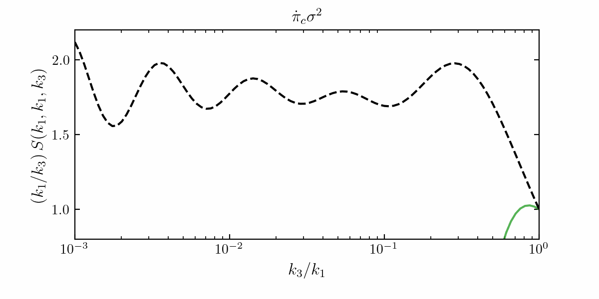
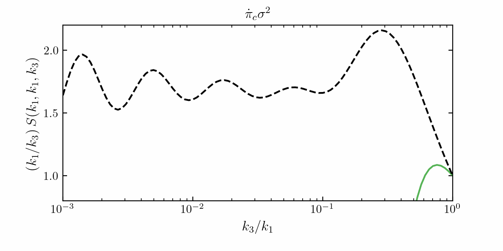

# The Cosmological Collider Flow

This folder contains the movies of the time evolution of the Cosmological Collider signals. We are interested in the three-point correlation function of the curvature perturbation in Fourier space, known as the bispectrum. Following standard conventions, we define the dimensionless shape function S such that 

$$
\langle \zeta_{\vec{k}_1} \zeta_{\vec{k}_2} \zeta_{\vec{k}_3}\rangle' = \frac{(2\pi)^4}{(k_1 k_2 k_3)^2} \Delta_\zeta^4 \, S(k_1, k_2, k_3),
$$

where $\Delta_\zeta^2 = \frac{k^3}{2\pi^2} \langle \zeta_{\vec{k}} \zeta_{-\vec{k}}\rangle'$ is the dimensionless power spectrum of thecurvature perturbation. The movies below display the shape function as a function of time for the following interaction $\dot{\pi}_c \sigma^2$, both for $\rho/H = 0.1$ (weak mixing) and $\rho/H = 5$ (strong mixing).

### Weak Mixing

For $\mu_{\rm{eff}} = 5, \rho/H = 0.1$

  

### Strong Mixing

For $\mu_{\rm{eff}} = 5, \rho/H = 5$

  

